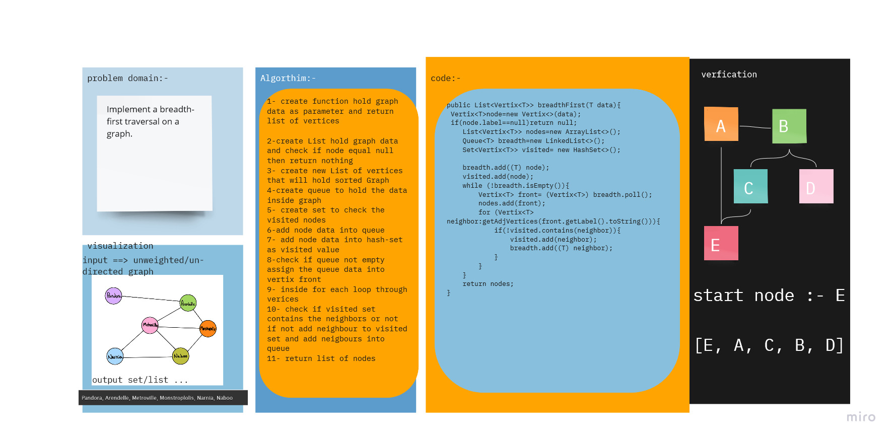
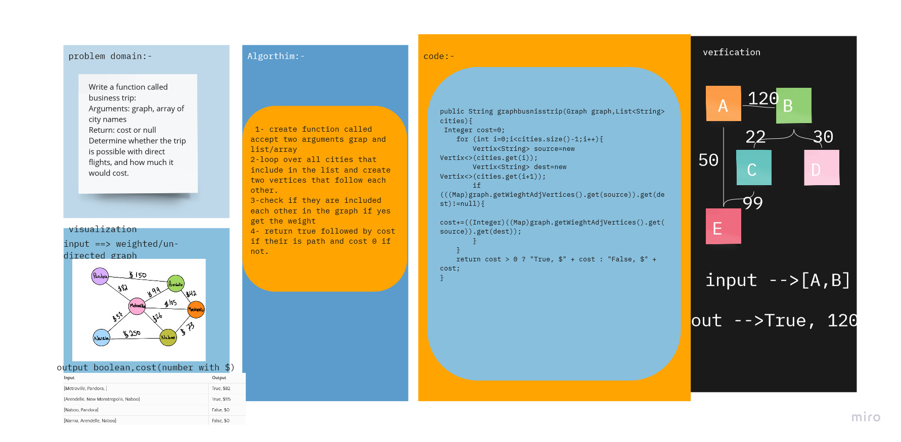
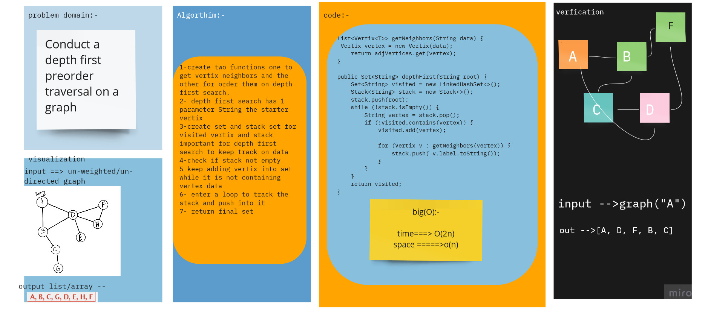

# Graphs
<!-- Short summary or background information -->

A graph is a data structure that consists of the following two components:
1. A finite set of vertices also called as nodes.
2. A finite set of ordered pair of the form (u, v) called as edge. The pair is ordered because (u, v) is not the same as (v, u) in case of a directed graph(di-graph). The pair of the form (u, v) indicates that there is an edge from vertex u to vertex v. The edges may contain weight/value/cost.
   Graphs are used to represent many real-life applications: Graphs are used to represent networks. The networks may include paths in a city or telephone network or circuit network. Graphs are also used in social networks like linkedIn, Facebook. For example, in Facebook, each person is represented with a vertex(or node). Each node is a structure and contains information like person id, name, gender, and locale. See this for more applications of graph.
   Following is an example of an undirected graph with 5 vertices.

The following two are the most commonly used representations of a graph.
1. Adjacency Matrix
2. Adjacency List
   There are other representations also like, Incidence Matrix and Incidence List. The choice of graph representation is situation-specific. It totally depends on the type of operations to be performed and ease of use.

**Adjacency Matrix:**
Adjacency Matrix is a 2D array of size V x V where V is the number of vertices in a graph. Let the 2D array be adj[][], a slot adj[i][j] = 1 indicates that there is an edge from vertex i to vertex j. Adjacency matrix for undirected graph is always symmetric. Adjacency Matrix is also used to represent weighted graphs. If adj[i][j] = w, then there is an edge from vertex i to vertex j with weight w.

## Challenge
<!-- Description of the challenge -->
Implement your own Graph. The graph should be represented as an adjacency list, and should include the following methods:

**add node**
 Arguments: value
 Returns: The added node
Add a node to the graph
**add edge**
 Arguments: 2 nodes to be connected by the edge, weight (optional)
 Returns: nothing
 Adds a new edge between two nodes in the graph
 If specified, assign a weight to the edge
Both nodes should already be in the Graph 
**get nodes**
 Arguments: none
 Returns all of the nodes in the graph as a collection (set, list, or similar) 
**get neighbors**
 Arguments: node
 Returns a collection of edges connected to the given node
 Include the weight of the connection in the returned collection 
**size** 
Arguments: none
Returns the total number of nodes in the graph 

## Approach & Efficiency
<!-- What approach did you take? Why? What is the Big O space/time for this approach? -->
**add edge** 
Space(n^2) 
Time(1)

**get nodes** 
Space(n^2) 
Time(1)

**get neighbors** 
Space(n^2) 
Time(1)

**size** 
Space(1) 
Time(1)

## API
<!-- Description of each method publicly available in your Graph -->
**add edge**
 Arguments: 2 nodes to be connected by the edge, weight (optional)
 Returns: nothing
 Adds a new edge between two nodes in the graph
 If specified, assign a weight to the edge
Both nodes should already be in the Graph 
**get nodes**
 Arguments: none
 Returns all of the nodes in the graph as a collection (set, list, or similar) 
**get neighbors**
 Arguments: node
 Returns a collection of edges connected to the given node
 Include the weight of the connection in the returned collection 
**size** 
Arguments: none
Returns the total number of nodes in the graph 

## code-36
# Challenge Summary
<!-- Short summary or background information -->
Implement a breadth-first traversal on a graph.

## Challenge Description
<!-- Description of the challenge -->
Extend your graph object with a breadth-first traversal method that accepts a starting node. Without utilizing any of the built-in methods available to your language, return a collection of nodes in the order they were visited. Display the collection.

## Approach & Efficiency
<!-- What approach did you take? Why? What is the Big O space/time for this approach? -->
First started out by drawing out the whiteboard before coding. 
Then I wrote out the code and tests for the challenge. 
The Big O space is O(v), and the time is O(v) with v being the number of vertices.

## Solution
<!-- Embedded whiteboard image -->

## code-37
# Challenge Summary
<!-- Short summary or background information -->
Write a function called business trip:
Arguments: graph, array of city names
Return: cost or null
Determine whether the trip is possible with direct flights, and how much it would cost.
## Challenge Description
<!-- Description of the challenge -->
Utilize the Single-responsibility principle: any methods you write should be clean, reusable, abstract component parts to the whole challenge. You will be given feedback and marked down if you attempt to define a large, complex algorithm in one function definition.

Write at least three test assertions for each method that you define.

Ensure your tests are passing before you submit your solution.
## Approach & Efficiency
<!-- What approach did you take? Why? What is the Big O space/time for this approach? -->
First started out by drawing out the whiteboard before coding.
Then I wrote out the code and tests for the challenge.
The Big O space is O(n), and the time is O(2n).

## Solution
<!-- Embedded whiteboard image -->

# code 38
