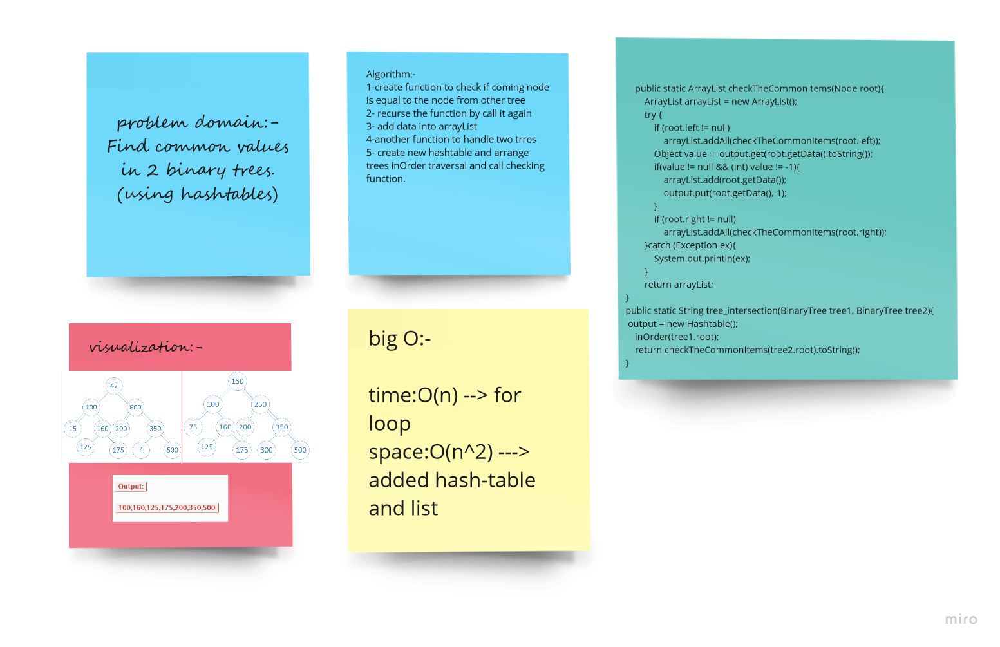

# Hashtables
<!-- Short summary or background information -->
* Hashtable - maps keys to values.
* To store and retrieve objects from the hashtable, objects used as keys must implement the hashCode method and equals method.
* Any non-null object can be used as a key or as a value.

## Challenge
<!-- Description of the challenge -->
* Implement a Hashtable with the following methods:
    - add: takes in both the key and value. This method should hash the key, and add the key and value pair to the table, handling collisions as needed.
    - get: takes in the key and returns the value from the table.
    - contains: takes in the key and returns a boolean, indicating if the key exists in the table already.
    - hash: takes in an arbitrary key and returns an index in the collection.
* Structure and Testing
    - Utilize the Single-responsibility principle: any methods you write should be clean, reusable, abstract component parts to the whole challenge. You will be given feedback and marked down if you attempt to define a large, complex algorithm in one function definition.
    - Write tests to prove the following functionality:
    - Adding a key/value to your hashtable results in the value being in the data structure
    - Retrieving based on a key returns the value stored
    - Successfully returns null for a key that does not exist in the hashtable
    - Successfully handle a collision within the hashtable
    - Successfully retrieve a value from a bucket within the hashtable that has a collision
    - Successfully hash a key to an in-range value

## Approach & Efficiency
<!-- What approach did you take? Why? What is the Big O space/time for this approach? -->
First I look up about hashtables, so I can have a better understanding of how they work. Then I set up the folder and file for this code challenge. Then I went over the demo, and compared it to other examples I found. Then I wrote out the code, and then wrote out the tests. The Big O space is O(n), and the time is O(1).

## API
<!-- Description of each method publicly available in each of your hashtable -->
* Methods
    - hashTable method - takes in the busckets
    - add method - takes in both the key and value. This method should hash the key, and add the key and value pair to the table, handling collisions as needed.
    - get method - takes in the key and returns the value from the table.
    - contains method - takes in the key and returns a boolean, indicating if the key exists in the table already.
    - hash method - takes in an arbitrary key and returns an index in the collection.
    - toString method - strings the lines together
    - Node class - takes in a value and next

## code-challenge 31
# Challenge Summary
<!-- Description of the challenge -->
create function return repeated words inside String.
## Whiteboard Process
<!-- Embedded whiteboard image -->

## Approach & Efficiency
<!-- What approach did you take? Why? What is the Big O space/time for this approach? -->

- Write a function called repeated word that finds the first word to occur more than once in a string
- Arguments: string
- Return: string

## Solution
<!-- Show how to run your code, and examples of it in action -->
mentioned in whiteboard

## code-challenge 32
# Challenge Summary
<!-- Description of the challenge -->
Find common values in 2 binary trees. (using hashtables)
## Whiteboard Process
<!-- Embedded whiteboard image -->

## Approach & Efficiency
<!-- What approach did you take? Why? What is the Big O space/time for this approach? -->

- Write a function called tree_intersection that takes two binary trees as parameters.
- Using your Hashmap implementation as a part of your algorithm, return a set of values found in both trees.

## Solution
<!-- Show how to run your code, and examples of it in action -->
mentioned in whiteboard
